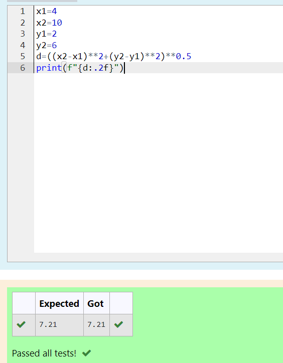

# DISTANCE-BETWEEN-TWO-POINTS

## AIM:
To write a python program to find the distance two 2 points
## ALGORITHM:
### Step 1:
Initial variable x2,y2,x1,y1 and assign the value to the variable 

### Step 2: 
Then initial variable d
### Step 3: 
Substitute the values in the distance formula
 Substitute the values in the distance formula  
### Step 4: 
Round of the value d to two decimal
### Step 5: 
Print the value d
### PROGRAM:
```py
x1=4
x2=10
y1=2
y2=6
d=((x2-x1)**2+(y2-y1)**2)**0.5
print(f"{d:.2f}")
```
  


### OUTPUT:



### RESULT:
Thus the distance between two points are successfully executed
